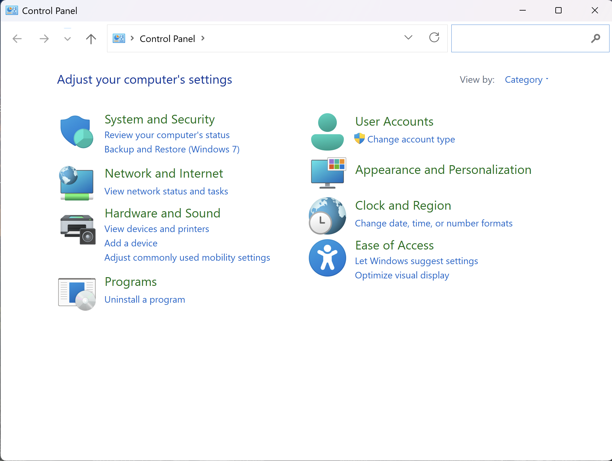
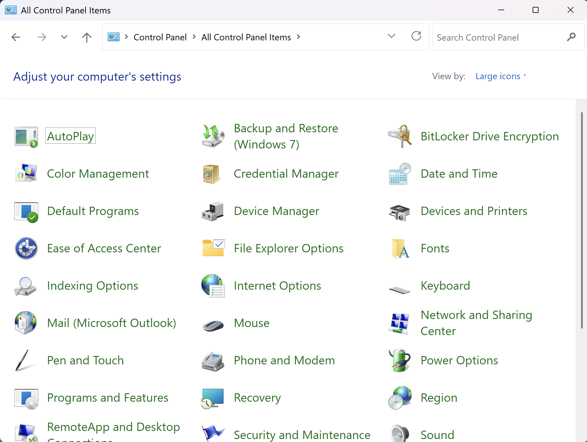

# ITD-email-setup

# New Outlook Email Setup - June 2026

*Note - Outlook (paid) is part of Microsoft 365 or Office 2024, not the free Outlook that comes with Windows, known as New Outlook - these instructions will not work with the New Outlook (free, included with Windows)*

## If Outlook is not installed, go to:

https://office.com

and sign in with your Microsoft account.

* Click on the grid of nine dots in the top of the left sidebar
* Click on "More Apps"
* Click on "Install apps" in the top right
* click on "Microsoft 365 apps" if you have a Microsoft 365 subscription, or click on the Office 2024 you purchased. You may need to add a license key to use the Office 2024 you purchased.
* Follow the instructions to install.

* Once installed, do not open Outlook.

---

## Outlook is installed

* Press Windows+r or the Windows icon on the Task Bar
(press and hold the Windows key on the keyboard and then press "r")
* Type "control" and press Enter
* Control Panel will open

* Up near the top, in the toobar, click the ">" to the right of "Control Panel" and select "All Control Panel Items"

* Click on "Mail (Microsoft Outlook)" - if you do not see this, Outlook is not installed, so go back and install it

---

* "Mail Setup - Outlook" opens
* Click on the button "Email Accounts"
* Any Email accounts already setup are shown, or none if it is a new installation of Outlook

---

## Account Settings

* Click the "New" button to add a new email account
* Fill in your Name (this will display in your emails)
* Fill in your email address
* Copy/paste your password twice in the two boxes
* Click "Manual setup or additional server type"
* Click "Next"

---

* "Choose Your Account Type" opens
* Select "POP or IMAP" and click "Next"

---

* Make sure "POP3" shows on Account Type
* Set "Incoming mail server" and "Outgoing mail server (SMTP)" to: cloud01.infotechdesign.ws (copy and paste the server name)
* Copy/paste your email address into "User Name"
* Copy/paste your password into "Password"
* Make sure "Deliver new messages to:" is set to "New Outlook Data File"
* Click on "More Settings

---

* "Internet Email Settings" opens
* Click on the "Outgoing Server" tab
* Check the box "My outgoing server (SMTP) requires authentication
* Make sure "Use the same settings as my incoming mail server" is selected
* Click on the "Advanced" tab
* Change the "Incoming server (POP3) port to "995"
* Check the box "This server requires an encrypted connection (SSL/TLS)"
* Change the "Outgoing server (SMTP) port to "465"
* Change "Use the following type of encrypted connection" to "SSL/TLS"
* Make sure "Leave a copy of messages on the server" is checked (under "Delivery")
* Make sure "Remove from server after" is set to anywhere from 14 to 30 days
(your email will also be available in webmail and/or mobile apps for the number of days you select - email older than that will only be on Outlook on your computer)
* Click "OK"
* Click "Next"

---

* "Test Account Settings" opens
* "Congratulations! All tests completed successfully. Click Close to continue" appears
* Click "Close"
(If this does not work, go back and review your settings, correcting them and trying again. If it still doesn't work, go back and to the Account Settings screen. Click on the Data Files tab, select the data file named for your email address and click "Remove". Then go to the Email tab, select the email account your just added and click "Remove". Then go back to "Account Settings" above in these instructions and try again)

---

* "You're all set!" appears
* Uncheck "Set up Outlook Mobile on my phone"
* Click "Finish"

---

* Open Outlook
* You will see your new email account in the left sidebar
* If "Inbox" doesn't show under it, click the down arrow "v" to show it
* Click on Inbox to select the account and start using it

*Note - we recommend that you do not turn on "Try the new Outlook"*